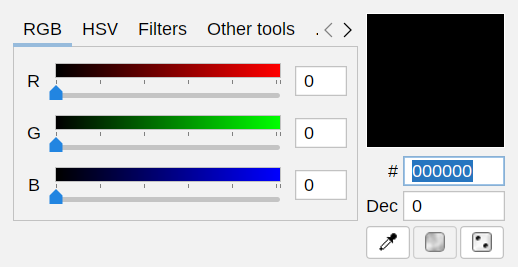

# ColorPicker

Selector de colores ligero y potente para **Linux**, escrito en **Java 17 + Swing** y
empaquetado como programa instalable (`.deb`) para **Linux Mint** (y en general
Ubuntu/Debian).

> *Simple but powerful color picker*: pocas funciones inútiles, todas las útiles.

## Cómo funciona

- **Arranque**: `colorpicker.Main` comprueba que hay pantalla gráfica, instala el
  tema FlatLaf, carga el idioma (en el primer arranque usa el del sistema), reclama
  la instancia única y crea `MainWindow`. Si la aplicación ya estaba abierta, la
  segunda ejecución solo trae la ventana existente al frente.
- **Estado central**: `core/ColorManager` guarda el color actual y avisa a todos los
  oyentes cuando cambia. No hay estado duplicado en la interfaz.
- **Sincronización de controles**: las barras `GradientSlider` (RGB y HSV) y las
  cajas `InputField` (R/G/B, H/S/V, `#` y `Dec`) se suscriben a ese mismo
  `ColorManager`. Mover cualquier control dispara `setRGB`/`setHSV`, que recalcula
  el resto de controles en un único paso. Hay guardas para no reescribir la caja
  que el usuario está escribiendo en ese momento.
- **Lógica de colores sin interfaz** (`core/`): conversiones RGB↔HSV↔hex↔decimal,
  color web-safe, filtros (grises, negativo, sepia, …) y extracción de los colores
  distintos de una imagen. Es la parte que cubren las pruebas unitarias.
- **Idiomas** (`i18n/`): archivos `lang_<Idioma>.txt` con pares `clave=valor` y
  secciones `CLAVE:SUBCLAVE`; el idioma se cambia en la pestaña Ajustes y se
  notifica a todas las ventanas abiertas.
- **Ajustes** (`settings/AppSettings`): se guardan en
  `~/.config/colorpicker/settings.properties`.
- **Interfaz** (`ui/`): `MainWindow` (ventana principal con pestañas),
  `ScreenColorPicker` (cuentagotas sobre una captura de pantalla con lupa) y los
  diálogos de las herramientas (combinador, aleatorio avanzado, colores de imagen).

## Características

- **RGB y HSV**: barras de color (con degradado) y cajas de texto para R, G, B y
  H, S, V; cada espacio de color en su pestaña (se pueden ocultar en Ajustes).
- **Hexadecimal y decimal**: `#RRGGBB` y el valor decimal del color; la caja se pone
  roja si el valor no es válido.
- **Muestra del color**: se puede arrastrar el color (como texto `#RRGGBB`) a otras
  aplicaciones o soltar sobre ella un código hexadecimal. Con clic derecho copia el
  color en otros formatos: VB.NET, Hex para VB, CSS, WinForms, hexadecimal y HSV.
- **Selector de color en pantalla** (cuentagotas): clic izquierdo para elegir un
  color de cualquier parte de la pantalla, clic derecho para salir. Opcionalmente
  copia el código hexadecimal al portapapeles.
- **Color aleatorio** y conversión al **color web-safe** más cercano.
- **Filtros**: escala de grises, negativo, sepia, más claro, más oscuro, intensificar,
  solo rojo / verde / azul y mezcla de canales RGB.
- **Otras herramientas**:
  - *Combinador de colores*: mezcla tantos colores como quieras.
  - *Color aleatorio avanzado*: colores aleatorios con mucho rojo, verde, azul,
    saturación o brillo, escala de grises o web-safe.
  - *Obtener todos los colores de una imagen*: lista los colores distintos de una
    imagen, con progreso y tiempo estimado.
- **Ajustes**: espacios de color visibles, optimizar velocidad, idioma y copiar al
  portapapeles tras seleccionar con el cuentagotas.
- **Idiomas**: inglés, francés, español y noruego. En el primer arranque se usa el
  idioma del sistema.
- **Instancia única**: si se abre de nuevo, se trae al frente la ventana ya abierta.

## Uso del programa

Resumen rápido de lo que hace cada cosa:

1. **Elegir un color**: mueve las barras RGB o HSV, o escribe directamente en las
   cajas (R/G/B, H/S/V, `#RRGGBB` o valor decimal). Todo se sincroniza solo: lo que
   cambias en una pestaña se refleja en las demás. Si el valor no es válido, la caja
   se pone roja y se ignora.
2. **Cuentagotas** (botón con la pipeta, abajo): clic izquierdo en cualquier punto de
   la pantalla para capturar ese color, clic derecho para salir. Si en *Ajustes*
   activas «Copiar Hex al portapapeles», el código se copia solo al seleccionar.
3. **Muestra de color** (el cuadro de la columna derecha):
   - **arrastrar hacia fuera** → lleva el color como texto `#RRGGBB` a otra aplicación;
   - **soltar** un código hexadecimal encima → lo aplica;
   - **clic derecho** → menú para copiar el color en otros formatos (VB.NET, Hex para
     VB, CSS, WinForms, hexadecimal y HSV).
4. **Los tres botones de abajo**: pipeta (selector en pantalla), **web-safe** (ajusta
   al color web válido más cercano) y **dado** (color aleatorio).
5. **Pestaña Filtros**: aplica el filtro al color actual (grises, negativo, sepia,
   más claro/oscuro, intensificar, solo R/G/B, mezcla de canales).
6. **Pestaña Otras herramientas**: combinar varios colores, generar aleatorios
   avanzados y sacar todos los colores de una imagen (se puede arrastrar la imagen
   sobre la ventana).
7. **Pestaña Ajustes**: mostrar/ocultar las pestañas RGB y HSV, idioma, optimizar
   velocidad y copiar al portapapeles. Los cambios se guardan solos.

Trucos: el color inicial es el código hexadecimal que tengas en el portapapeles, y
si lanzas el programa otra vez la ventana ya abierta se trae al frente.

## Captura de pantalla

Ventana con pestañas y apariencia moderna gracias a FlatLaf.



## Requisitos

Para **usar** el programa:

- Linux Mint 21/22 (o Ubuntu 22.04+/Debian 12+), con sesión **X11** o **Wayland**.
  En Wayland la ventana corre mediante XWayland y el selector de color en pantalla
  funciona (comprobado en Ubuntu 26.04 con GNOME/Wayland). Solo en sesiones Wayland
  muy restrictivas la captura puede fallar (pantalla en negro o aviso «no se puede
  capturar la pantalla»); en ese caso el resto del programa sigue funcionando con
  normalidad.
- Paquete autocontenido: nada más (lleva su propio Java).
- Paquete ligero: Java 17 o superior con soporte gráfico (no basta un Java
  *headless*). `apt` lo instala como dependencia; a mano:
  `sudo apt install openjdk-17-jre`.

Para **compilar**:

- Un **JDK 17** completo (con `jpackage`): `sudo apt install openjdk-17-jdk`.
  Gradle lo detecta automáticamente (también los instalados con SDKMAN). Si tu JDK no
  trae `jpackage`, la tarea `jpackageDeb` lo indica; instala uno que lo incluya,
  por ejemplo Eclipse Temurin (`sdk install java 17.0.20-tem` con SDKMAN).
- Para los paquetes: `dpkg-deb` (ya instalado en Mint) y `fakeroot`
  (`sudo apt install fakeroot`).
- No hace falta instalar Gradle: se usa el *wrapper* (`./gradlew`), que la primera
  vez descarga Gradle y las dependencias (FlatLaf), así que necesita Internet.

## Ejecutar desde el código fuente

```bash
./gradlew run
```

O bien, generando el jar ejecutable (incluye todas las dependencias):

```bash
./gradlew fatJar
java -jar build/libs/colorPicker-1.0.0-all.jar
```

## Pruebas

```bash
./gradlew test
```

Las pruebas unitarias (JUnit 5) cubren la lógica sin interfaz gráfica: conversiones
RGB/HSV, filtros, códigos hexadecimales, validación numérica, extracción de colores
de imágenes, idiomas y ajustes. Se ejecutan en modo *headless*. El informe queda en
`build/reports/tests/test/index.html`.

## Construir los paquetes `.deb`

Lo más cómodo es el script, que comprueba los requisitos, compila, pasa las pruebas y
genera los dos paquetes:

```bash
packaging/build-deb.sh
```

O directamente con Gradle:

```bash
./gradlew jpackageDeb     # paquete autocontenido
./gradlew debLight        # paquete ligero
```

Los paquetes quedan en `build/dist/`:

| Paquete | Archivo | Tamaño | Necesita Java instalado |
|---|---|---|---|
| **Autocontenido** (recomendado) | `colorpicker_1.0.0-1_amd64.deb` | ~25 MB (~100 MB instalado) | No: incluye un Java 17 mínimo |
| Ligero | `colorpicker-light_1.0.0_all.deb` | ~1 MB | Sí, Java 17 o superior |

**¿Cuál elegir?** El **autocontenido** es el recomendado: funciona siempre, sin
depender de la versión de Java del sistema. Se crea con `jpackage`, que incluye un
Java reducido con solo los módulos que usa el programa (calculados con `jdeps`:
`java.base`, `java.desktop` y sus dependencias), más `jdk.localedata` para que los
números salgan con el formato regional del sistema (p. ej. el progreso `12,5%` de la
herramienta de colores de imagen). El **ligero** es mucho más pequeño y sirve para
cualquier arquitectura, pero usa el Java del sistema (lo instala `apt` como
dependencia). Los dos paquetes no pueden estar instalados a la vez.

Notas:

- Las dependencias del paquete autocontenido (p. ej. `libasound2t64`) se calculan en
  la máquina donde se construye: constrúyelo en la misma versión de Mint/Ubuntu en la
  que lo vas a instalar. El ligero sirve para cualquier versión.
- `-PpackagingJdk=25` construye el paquete autocontenido con Java 25 en lugar de 17
  (necesita un JDK 25 instalado): `./gradlew jpackageDeb -PpackagingJdk=25`. El
  archivo y la versión del paquete (`1.0.0-1`) son los mismos con los dos JDK.
- `-PextraModules=<módulo>,...` añade al Java incluido otros módulos que `jdeps` no
  puede detectar (proveedores de servicios); `jdk.localedata` ya se incluye siempre.
- El lanzador del paquete ligero usa el primer Java 17 o superior con soporte gráfico
  que encuentra: `$JAVA_HOME`, `/usr/lib/jvm/default-java`, el `java` del `PATH` y
  luego `/usr/lib/jvm/java-{25,21,17}-openjdk-*`. Los Java *headless* se saltan.

## Instalar y desinstalar en Linux Mint

Instalar (elige uno de los dos):

```bash
sudo apt install ./build/dist/colorpicker_1.0.0-1_amd64.deb
# o bien
sudo apt install ./build/dist/colorpicker-light_1.0.0_all.deb
```

También puedes hacer doble clic en el `.deb` para abrirlo con el instalador de
paquetes de Mint. Después, la aplicación aparece en el menú (**Gráficos** y
**Accesorios**) y se puede lanzar desde la terminal con `colorPicker`.

Desinstalar:

```bash
sudo apt remove colorpicker          # paquete autocontenido
sudo apt remove colorpicker-light    # paquete ligero
```

Qué instala cada uno:

- Autocontenido: el programa y su Java en `/opt/colorpicker`, la entrada del menú y
  el comando `/usr/bin/colorPicker` (enlace a `/opt/colorpicker/bin/colorPicker`).
- Ligero: `/usr/share/colorpicker/colorPicker.jar`, el lanzador
  `/usr/bin/colorPicker`, `/usr/share/applications/colorPicker.desktop`, los iconos en
  `/usr/share/icons/hicolor/.../apps/colorPicker.png`.

## Dónde se guardan los ajustes

En `~/.config/colorpicker/settings.properties` (o en `$XDG_CONFIG_HOME/colorpicker`
si esa variable está definida). Las opciones son: `language`,
`useRGB`, `useHSV`, `optimizeSpeed`, `clipCopy` y `firstTime`. Para volver a los
valores de fábrica basta con borrar ese archivo. Desinstalar el paquete no lo borra.

## Estructura del proyecto

```
ColorPicker/
├── build.gradle, settings.gradle, gradlew     compilación (Gradle 8, Java 17)
├── packaging/
│   ├── packaging.gradle                       tareas fatJar, jpackageDeb, debLight
│   ├── build-deb.sh                           script para generar los .deb
│   └── linux/                                 .desktop, control, copyright, lanzador,
│                                              añadidos a postinst/prerm de jpackage
└── src/
    ├── main/java/colorpicker/
    │   ├── Main.java, App.java                arranque, ventana principal compartida
    │   ├── SingleInstance.java                instancia única (socket Unix)
    │   ├── LinuxIntegration.java              WM_CLASS de X11 (agrupa en el panel)
    │   ├── core/                              lógica de colores (sin interfaz)
    │   ├── i18n/                              idiomas
    │   ├── settings/                          ajustes
    │   └── ui/                                ventanas Swing
    ├── main/resources/colorpicker/
    │   ├── images/                            iconos e imágenes de la interfaz
    │   └── lang/                              archivos de idioma
    └── test/java/                             pruebas JUnit 5
```

## Notas de comportamiento

1. **"Copy Hex for VB" y "Copy hexadecimal"** usan siempre dos dígitos por canal:
   `&H00BBGGRR` y `0xBBGGRR`.
2. **"Copiar Hex al portapapeles tras la selección"** se guarda y la casilla muestra el
   valor guardado.
3. Los **colores aleatorios** incluyen el límite superior (255 en RGB, 100 % en S/V) y
   el tono va de 0 a 359.
4. Se aceptan **códigos hexadecimales en minúsculas** en todas partes.
5. Las **claves de idioma** que no se encuentran caen al inglés (p. ej.
   `TOOL_ALLCOLORS:MSG_INITIALIZING`).
6. El **selector en pantalla** trabaja sobre una captura congelada de la pantalla con
   una lupa. Funciona en X11 y también en Wayland (p. ej. Ubuntu 26.04 con GNOME,
   donde la captura llega por XWayland). Si la sesión impide capturar la pantalla, la
   imagen sale en negro o aparece el aviso «no se puede capturar la pantalla»; el
   resto del programa no se ve afectado.
7. Los **ajustes** se guardan en `~/.config/colorpicker/settings.properties`.
8. La **instancia única** usa un archivo de bloqueo y un socket Unix
   (`$XDG_RUNTIME_DIR/colorpicker-<usuario>.lock` / `.sock`): al abrirla otra vez se
   trae al frente la ventana existente.
9. Apariencia **FlatLaf** (tema claro); las ventanas usan gestores de diseño para que
   no se corten los textos en ningún idioma con las fuentes de Linux.
10. **Color aleatorio avanzado con «escala de grises»** (pestaña Avanzado, en RGB y en
    HSV): la fila 1, rotulada «V», es el brillo del gris en % (0–100 → nivel 0–255).
    Las filas 2–3 desactivadas no bloquean «Generar».
11. En la casilla **#** se puede pegar un código `#RRGGBB` o `#RGB` (con o sin espacios):
    el `#` y los espacios se descartan antes de aplicar el límite de 6 caracteres.
12. Al escribir en una casilla numérica, el texto no se reescribe mientras se escribe; se
    sincroniza con el color actual al salir de la casilla. Las casillas # y Dec vuelven a
    su fondo normal cuando el color cambia desde otro control.
13. Los **deslizadores** siguen las convenciones de Linux/Swing: Arriba/Derecha/RePág
    aumentan el valor y todas las flechas avanzan de 1 en 1. Pulsar sobre el control
    deslizante lo agarra sin cambiar el valor; pulsar en la barra salta a esa posición.
14. Las casillas de **velocidad** y **portapapeles** se guardan al momento y no se
    pueden desmarcar a la vez RGB y HSV ni siquiera en el primer arranque.
15. En la herramienta **Obtener todos los colores de una imagen** se puede soltar un
    archivo de imagen sobre la ventana; los formatos admitidos son los de Java ImageIO
    (PNG, JPEG, GIF, BMP, WBMP, TIFF). ICO/EMF/WMF no se admiten.
16. Las casillas numéricas solo aceptan números enteros sin signo.
17. Las **herramientas** (combinador, aleatorio avanzado, colores de imagen) son diálogos
    no modales que pertenecen a la ventana principal: quedan por encima de ella y no
    tienen botón propio en la barra de tareas ni botón de minimizar.
18. El **color inicial** se toma del portapapeles si el texto es `RRGGBB` o `#RRGGBB`
    (con o sin espacios alrededor).
19. **«Optimizar velocidad»** solo afecta a la herramienta de colores de imagen (pausa
    breve cada 2048 elementos y refresco del progreso cada 400 ms en vez de 200 ms); el
    selector en pantalla no usa temporizador, así que no le afecta. Los tiempos de
    60 s o más se muestran como `H:mm:ss` en todos los idiomas.
20. El diálogo para abrir imagen añade un filtro «imágenes» (seleccionado por defecto)
    además de «Todos los archivos».
21. En X11, los **cursores personalizados** de Java solo admiten 2 colores: al arrastrar
    un color, la flecha del cursor se dibuja con el color arrastrado y el borde negativo
    de la muestra no se ve.
22. El error «no se puede capturar la pantalla» del selector usa la clave de idioma
    `PICKER:CAPTUREERROR`, presente en los cuatro archivos de idioma.
23. No hay pestaña de Créditos ni marcas de terceros: la aplicación es software libre y
    no promociona a nadie.

## Cómo añadir un idioma

1. Copia `src/main/resources/colorpicker/lang/lang_English.txt` como
   `lang_<Idioma>.txt` (UTF-8) y traduce los valores (lo que va después de `=`;
   `\n` es un salto de línea). Ajusta la cabecera `#name=` y `#shortname=`.
2. Añade una constante al enum `src/main/java/colorpicker/i18n/Language.java` con el
   código ISO de dos letras, el nombre que se muestra en la lista y el nombre del
   archivo, p. ej. `GERMAN("de", "Deutsch", "lang_German.txt")`.
3. Compila con `./gradlew run`: el idioma aparece en la pestaña de Ajustes. Las claves
   que falten se muestran en inglés.

## Licencia

GNU General Public License 3.0 (ver [`LICENSE`](LICENSE)). Software libre: puedes
usarlo, modificarlo y redistribuirlo bajo los mismos términos. FlatLaf se distribuye
bajo la licencia Apache 2.0.
